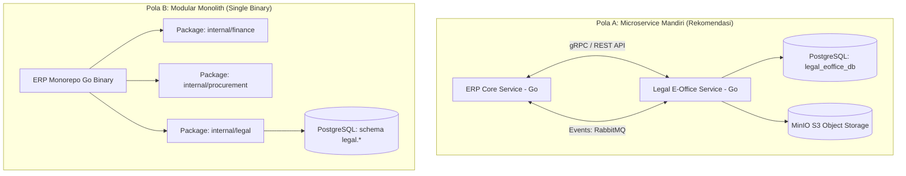

# 01. Arsitektur Sistem & Tech Stack: Legal E-Office Module

Dokumen ini menjelaskan rancangan arsitektur perangkat lunak, spesifikasi teknologi (*tech stack*), pola integrasi dengan backend ERP Golang yang sudah ada, serta strategi isolasi data dan keamanan.

---

## 1. Pilihan Pola Arsitektur Modul

Modul Legal E-Office dapat diintegrasikan dengan dua pendekatan sesuai arsitektur ERP Golang yang ada:



### Rekomendasi: Pola A (Microservice / Standalone Sub-Service)
* **Kelebihan**: Tim legal atau developer modul hukum dapat melakukan deployment, update versi template, dan scaling tanpa harus me-restart seluruh proses core ERP yang melayani transaksi keuangan/inventory.
* **Komunikasi Antar-Layanan**: REST JSON untuk sinkron (UI/Client Gateway) dan RabbitMQ/NATS untuk asinkron (notifikasi, audit event, sync karyawan).

---

## 2. Rincian Tech Stack

### 2.1 Backend (Go / Golang)

| Komponen | Pilihan Teknologi | Alasan Pemilihan & Keunggulan |
|---|---|---|
| **Bahasa Pemrograman** | **Go (Golang 1.22+)** | Performa tinggi, footprint memori sangat rendah (<50MB RAM runtime), native concurrency (*goroutines*) untuk memproses file dokumen besar & background reminder. |
| **HTTP Framework / Router** | **Echo v4** atau **Gin Engine** | Routing ultra-cepat, middleware ekosistem lengkap (CORS, JWT, Logger, RateLimiter, Recovery), kemudahan integrasi OpenAPI/Swagger. |
| **RPC Inter-service** | **gRPC & Protocol Buffers (proto3)** | Komunikasi internal berkecepatan tinggi dengan modul Core ERP (misal: validasi nomor vendor, status kredit, dan plafon anggaran). |
| **Database ORM / Driver** | **GORM v2** atau **pgx v5 (Native Driver)** | Dukungan native PostgreSQL JSONB (sangat penting untuk menyimpan klausul dinamis dan merge fields template), migrasi otomatis, dan connection pooling. |
| **Database Engine** | **PostgreSQL 15+** | Relasional ACID tangguh, dukungan Full-Text Search untuk pencarian klausul/surat, dan tipe data JSONB fleksibel. |
| **In-Memory Cache & Session** | **Redis 7+** | Caching token otorisasi, counter nomor surat (penomoran otomatis bebas race condition), dan distributed locking alur approval. |
| **Message Broker** | **RabbitMQ** atau **NATS JetStream** | Menyalurkan event asinkron antar modul ERP (misal: event `CONTRACT_EXPIRED`, `TENDER_DOC_MISSING`, `SOMASI_SENT`). |
| **Document Object Storage** | **MinIO (S3 Compatible)** | Menyimpan file fisik (.pdf, .docx, scan warkat garansi bank, lampiran izin OSS) secara terenkripsi di server internal (*on-premise* atau *private cloud*). |
| **PDF & DOCX Generator** | **unioffice** / **jung-kurt/gofpdf** / **gotenberg** | Konversi otomatis draf teks hasil generate naskah menjadi file resmi PDF bertanda tangan digital atau DOCX siap cetak. |

### 2.2 Frontend (Web Client)

| Komponen | Pilihan Teknologi | Keterangan & Karakteristik |
|---|---|---|
| **Framework** | **Vue.js 3 (Composition API)** | Reaktivitas modern dengan `<script setup>`, performa rendering optimal, dan arsitektur komponen modular. |
| **Build Tool** | **Vite 6+** | HMR (*Hot Module Replacement*) instan, build bundle sangat cepat dan teroptimasi. |
| **Styling & Design System** | **Tailwind CSS v4** | Desain enterprise modern bertema pastel korporat (*corporate indigo, soft slate, emerald badges*). |
| **Ikonografi** | **Lucide Vue Next** | Set ikon vektor modern (lebih dari 1.000 ikon hukum, arsip, tender, dan keamanan). |
| **State Management** | **Pinia** / **Reactive Store** | Pengelolaan state terpusat untuk data sesi pengguna, keranjang dokumen, dan filter tabel. |
| **Micro-Frontend Packaging** | **Vite Module Federation** / **Single-SPA** | Memungkinkan modul UI Legal ini di-*load* dinamis di dalam shell dashboard ERP utama tanpa refresh halaman. |

---

## 3. Strategi Integrasi dengan ERP Golang

### 3.1 Otentikasi Terpusat (Shared JWT & SSO)
Legal E-Office **tidak membuat sistem login sendiri**, melainkan memverifikasi JWT yang diterbitkan oleh Core Auth Service ERP:

```go
// Contoh Middleware Verifikasi Token JWT ERP pada Backend Legal (Golang)
package middleware

import (
	"net/http"
	"strings"
	"github.com/golang-jwt/jwt/v5"
	"github.com/labstack/echo/v4"
)

type ErpClaims struct {
	UserID     string   `json:"user_id"`
	Email      string   `json:"email"`
	Name       string   `json:"name"`
	Department string   `json:"department"`
	EntityID   string   `json:"entity_id"`
	Roles      []string `json:"roles"`
	jwt.RegisteredClaims
}

func ErpAuthMiddleware(jwtSecret []byte) echo.MiddlewareFunc {
	return func(next echo.HandlerFunc) echo.HandlerFunc {
		return func(c echo.Context) error {
			authHeader := c.Request().Header.Get("Authorization")
			if authHeader == "" || !strings.HasPrefix(authHeader, "Bearer ") {
				return c.JSON(http.StatusUnauthorized, map[string]string{
					"error": "Autentikasi ERP diperlukan",
				})
			}

			tokenStr := strings.TrimPrefix(authHeader, "Bearer ")
			claims := &ErpClaims{}

			token, err := jwt.ParseWithClaims(tokenStr, claims, func(t *jwt.Token) (interface{}, error) {
				return jwtSecret, nil
			})

			if err != nil || !token.Valid {
				return c.JSON(http.StatusUnauthorized, map[string]string{
					"error": "Sesi token ERP kedaluwarsa atau tidak valid",
				})
			}

			// Simpan user context ke request context
			c.Set("user", claims)
			return next(c)
		}
	}
}
```

### 3.2 Matriks Sinkronisasi Antar-Modul ERP

| Modul ERP Asal | Data yang Dikirim ke Legal | Trigger / Alur Integrasi |
|---|---|---|
| **HRIS & Kepegawaian** | Master Karyawan, NIK, Jabatan, Divisi, Data Resign | Sinkronisasi berkala via Webhook/RabbitMQ. Ketika pegawai mutasi/resign, akses legal ditutup dan delegasi surat kuasa dicabut. |
| **Procurement (Pengadaan)** | Pemenang Tender, Nilai PO/HPS, Vendor ID | Setelah tender diputuskan di ERP, sistem pengadaan membuat *draft ticket* otomatis di modul Kontrak/SPK Legal E-Office. |
| **Finance & Treasury** | Status Pembayaran Termin, Rilis Invoice | Modul Keuangan memeriksa status kontrak Legal (harus bertatus `ACTIVE` / `SIGNED`) sebelum melakukan rilis pembayaran kas. |
| **Project & Asset** | Lokasi Aset Pabrik/Tambang, Masa Izin Operasi | Legal E-Office memantau masa kadaluarsa izin OSS/IUP dan sertifikat kelaikan alat berat/infrastruktur. |

---

## 4. Keamanan & Isolasi Data (Data Protection)

1. **Role-Based Access Control (RBAC) Ketat**:
   - `SUPERADMIN`: Kelola seluruh sistem, audit log, dan integrasi backend.
   - `LEGAL_HEAD`: Otorisasi persetujuan draf kontrak tingkat tinggi, opini hukum, dan litigasi.
   - `LEGAL_OFFICER`: Pelaksana operasional, registrasi surat, review dokumen, dan generate draf.
   - `REQUESTOR (Divisi Lain)`: Hanya dapat mengajukan tiket permohonan (*intake form*) dan mengunduh template baku umum. Seluruh data perkara rahasia dan LDD disembunyikan secara otomatis.
2. **Enkripsi Dokumen pada Object Storage**:
   - Berkas fisik yang diunggah ke MinIO/S3 dienkripsi pada level *Server-Side Encryption* (SSE-S3 / AES-256).
   - Akses pengunduhan berkas menggunakan *Presigned URL* dengan masa kedaluwarsa singkat (contoh: 10 menit).
3. **Audit Trail Imutabel**:
   - Setiap operasi (Create, Update Status, Download Berkas, Approval) dicatat pada tabel `activity_logs` yang tidak dapat diubah (*append-only*).

---
*Lanjutkan ke dokumen [02-katalog-fitur-dan-spesifikasi.md](./02-katalog-fitur-dan-spesifikasi.md) untuk mempelajari seluruh modul fungsional.*
