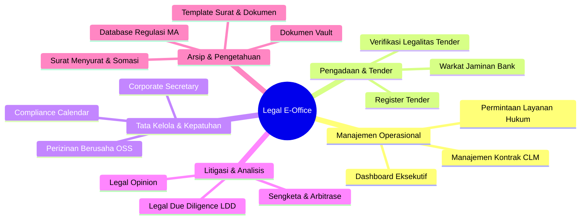

# 02. Katalog Fitur & Spesifikasi Fungsional: Legal E-Office

Dokumen ini memuat spesifikasi terperinci dari **16 modul bisnis** Legal E-Office yang siap diintegrasikan sebagai sub-sistem dalam ERP korporasi.

---

## 1. Peta Modul Legal E-Office

---

## 2. Rincian Modul & Fungsionalitas

### Modul 1: Dashboard Eksekutif Hukum (`dashboard`)
* **Tujuan**: Memberikan visibilitas terpusat bagi Direksi dan Kepala Divisi Hukum (*Chief Legal Counsel*) terhadap metrik kepatuhan, risiko, dan kontrak aktif.
* **Fitur Utama**:
  * **KPI Summary Cards**: Total kontrak aktif, nilai eksposur portofolio kontrak (Rp/USD), perkara litigasi berisiko tinggi (*high risk*), perizinan mendekati kadaluarsa (<60 hari), dan permohonan legal pending.
  * **Grafik Analitik**: Distribusi nilai kontrak per divisi bisnis, tren perkara hukum, dan status kepatuhan unit anak perusahaan.
  * **Smart Alert Banner**: Pengingat otomatis kontrak yang akan jatuh tempo dalam 30/60/90 hari kalender.

---

### Modul 2: Permintaan Layanan Hukum & Alur Persetujuan (`requests`)
* **Tujuan**: Saluran permohonan resmi (*intake desk*) dan mekanisme persetujuan berjenjang (*approval workflow*) dari unit bisnis (Procurement, Operation, Finance, HR) kepada tim legal korporat.
* **Fitur Utama**:
  * **Formulir Pengajuan Tiket**: Jenis permintaan (*Contract Review*, *Penyusunan Draf Baru*, *Legal Opinion*, *Dukungan Litigasi/Somasi*, *Konsultasi Izin*), tingkat urgensi (*HIGH ≤ 2 hari, MEDIUM ≤ 5 hari, LOW reguler*), entitas perseroan, target tenggat waktu (*SLA*), dan latar belakang kebutuhan.
  * **Alur Persetujuan Berjenjang (Approval Workflow)**:
    1. *Tahap 1: Pengajuan (Submitted)* — Pemohon unit bisnis mengajukan draf/kebutuhan.
    2. *Tahap 2: Penelaahan Legal (In Review)* — Legal Counsel mengkaji aspek risiko, kepatuhan, dan redaksi klausul.
    3. *Tahap 3: Otorisasi Persetujuan (Pending Approval)* — Otorisasi oleh Head of Legal, VP, atau Direksi Terkait.
    4. *Tahap 4: Finalisasi (Approved / Completed)* — Penerbitan surat rekomendasi, persetujuan kontrak, atau legal opinion resmi.
  * **Panel Dialog Keputusan Persetujuan (Approval Modal)**:
    * 🟢 **Setujui (Approve)**: Otorisasi langsung dengan catatan arahan pelaksanaan (*approval notes*).
    * 🟡 **Minta Revisi (Request Revision)**: Pengembalian tiket ke pemohon disertai poin perbaikan/dokumen pelengkap yang wajib dilengkapi.
    * 🔴 **Tolak (Reject)**: Penolakan resmi disertai alasan pertimbangan yuridis.
  * **Penugasan PIC Counsel**: Kepala Divisi Hukum menugaskan personil spesialis legal yang bertanggung jawab.
  * **Tracking & Filter Status**: Filter status lengkap (`PENDING_APPROVAL`, `SUBMITTED`, `IN_REVIEW`, `APPROVED`, `REVISION_REQUIRED`, `REJECTED`, `COMPLETED`, `OVERDUE`).

---

### Modul 3: Manajemen Kontrak / Contract Lifecycle Management (`contracts`)
* **Tujuan**: Pengelolaan menyeluruh siklus kontrak korporat dari tahap draf, negosiasi, persetujuan, tanda tangan, hingga addendum.
* **Fitur Utama**:
  * **Registrasi Kontrak Komersial**: Judul perjanjian, nomor registrasi surat kontrak, pihak mitra (*counterparty*), entitas perseroan, jenis kontrak (*PPA, EPC, Jasa, Sewa, Suplai Batubara, NDA*), nilai nominal dan mata uang.
  * **Pelacakan Masa Berlaku**: Tanggal efektif, tanggal berakhir (*expiry date*), klausul perpanjangan otomatis (*tacit renewal*).
  * **Klausul Kunci & Kewajiban Pokok**: Pencatatan ringkasan kewajiban pokok, termin pembayaran (*milestone payment*), batas tanggung jawab (*limitation of liability*), dan sanksi denda keterlambatan (*liquidated damages*).
  * **Manajemen Addendum & Amandemen**: Riwayat perubahan kontrak tanpa merusak data kontrak induk historis.
  * **Integrasi Modul Keuangan ERP**: Memvalidasi kesiapan kontrak sebelum bagian kasir/finance melakukan pembayaran kepada vendor.

---

> **Catatan Status Modul Tender (Phase 2 - Nonaktif Sementara)**:
> Modul 4 (Register Tender), Modul 5 (Verifikasi Legalitas Tender), dan Modul 6 (Warkat Jaminan Bank) saat ini **disembunyikan dari antarmuka pengguna (`ENABLE_TENDER_MODULE: false`)** guna memprioritaskan operasional inti Legal E-Office (CLM Kontrak, Surat Menyurat & Somasi, Approval Permintaan Legal, Corporate, Perizinan, dan Template Generator). Fitur tender dapat diaktifkan kembali kapan saja melalui konfigurasi sistem.

---

### Modul 4: Register & Arsip Tender Lintas Sektor (`tenders`) — *(Phase 2 - Hidden)*
* **Tujuan**: Administrasi partisipasi lelang proyek pemerintah (BUMN/LKPP) dan swasta di sektor Minyak & Gas, Ketenagalistrikan, Minerba, dan Konstruksi.
* **Fitur Utama**:
  * **Pencatatan Portofolio Tender**: Kode tender, nama pekerjaan, instansi pengguna jasa (contoh: *PT PLN, Pertamina, SKK Migas, KemenPUPR*), nilai HPS/Pagu Anggaran, metode lelang.
  * **Pelacak Tahapan Lelang**: Pemantauan tahapan Aanwijzing (penjelasan lelang), pemasukan dokumen kualifikasi/harga, sanggahan hasil lelang, hingga penerbitan SPPBJ.
  * **Riwayat Menang/Kalah (Win/Loss Tracking)**: Pencatatan evaluasi evaluatif jika lelang gagal atau menang.

---

### Modul 5: Verifikasi Dokumen Legalitas Tender (`tender-documents`)
* **Tujuan**: Verifikasi kelengkapan berkas kepatuhan lelang berbasis regulasi sektoral (contoh: *Pedoman Tata Kerja PTK-007 Revisi 05 SKK Migas*).
* **Fitur Utama**:
  * **Checklist Dokumen Wajib per Sektor**:
    * Sektor Migas: Surat Pengganti Dokumen Administrasi (SPDA) CIVD, Sertifikat TKDN, Surat Keterangan Dukungan Keuangan Bank.
    * Sektor Kelistrikan: Sertifikat Laik Operasi (SLO), IUPOK, Pengalaman sejenis (BAST).
    * Sektor Minerba: Izin Usaha Jasa Pertambangan (IUJP), RKAB resmi disetujui.
  * **Deteksi Dokumen Kurang / Kadaluarsa (*Gap Analysis*)**: Peringatan merah jika ada syarat mutlak tender yang belum lengkap atau sudah melewati masa berlakunya.

---

### Modul 6: Warkat Jaminan Bank / Tender Bonds (`tender-bonds`)
* **Tujuan**: Pengawasan warkat bank garansi dan *surety bond* yang diterbitkan atau dipegang perseroan.
* **Fitur Utama**:
  * **Tipe Jaminan**: Jaminan Penawaran (*Bid Bond*), Jaminan Pelaksanaan (*Performance Bond*), Jaminan Uang Muka (*Advance Payment Bond*), dan Jaminan Pemeliharaan (*Maintenance Bond*).
  * **Data Finansial Jaminan**: Bank penerbit (Mandiri, BRI, BNI, BCA, dll), nomor warkat asli, nilai garansi, masa klaim, dan tanggal jatuh tempo.
  * **Status & Alur Pencairan**: Pelacak apakah jaminan dalam status *ACTIVE*, *RETURNED*, atau diajukan klaim wanprestasi (*CLAIMED*).
  * **Pengingat Perpanjangan Otomatis**: Notifikasi sebelum masa laku garansi habis agar proyek tidak terkena diskualifikasi.

---

### Modul 7: Corporate Secretary & Tata Kelola Perusahaan (`corporate`)
* **Tujuan**: Dokumentasi hukum status badan usaha perseroan induk dan anak perusahaan.
* **Fitur Utama**:
  * **Profil Entitas & Modal Perseroan**: Data akta pendirian, modal dasar, modal ditempatkan, dan modal disetor.
  * **Daftar Pemegang Saham (Cap Table)**: Rincian persentase kepemilikan saham, jumlah lembar saham, dan nilai nominal.
  * **Susunan Direksi & Dewan Komisaris**: Nama pengurus, masa jabatan sesuai akta, NIK/NPWP, serta pembagian wewenang tanda tangan bank/kontrak.
  * **Arsip Akta Notaris & SK Kemenkumham**: Nomor akta, tanggal penetapan, nama notaris, dan nomor pengesahan AHU Kemenkumham RI.
  * **Dokumentasi RUPS & Pemilik Manfaat (BO)**: Risalah Rapat Umum Pemegang Saham (Tahunan/Luar Biasa) dan deklarasi *Beneficial Ownership*.

---

### Modul 8: Perizinan Berusaha OSS-RBA & Sektoral (`licensing`)
* **Tujuan**: Pemantauan izin operasional, lingkungan, dan legalitas teknis pabrik/tambang.
* **Fitur Utama**:
  * **Katalog Izin**: Nomor Induk Berusaha (NIB), Izin Lingkungan (AMDAL, UKL-UPL), Izin Pemanfaatan Air Tanah (SIPA), Izin Genset, SILO Crane/Alat Berat, Sertifikat Standar Terverifikasi.
  * **Instansi Penerbit**: Kementerian ESDM, KLHK, BKPM/Kemeninves, atau Pemerintah Daerah.
  * **Peringatan Masa Berlaku**: Notifikasi berjenjang H-90, H-60, H-30 hari sebelum masa berlaku habis untuk mencegah sanksi pembekuan izin operasi.

---

### Modul 9: Kepatuhan Regulasi & Compliance Calendar (`compliance`)
* **Tujuan**: Kalender pelaporan berkala yang diwajibkan oleh undang-undang.
* **Fitur Utama**:
  * **Agenda Kepatuhan Berkala**: Laporan Kegiatan Penanaman Modal (LKPM Triwulanan ke BKPM), Pelaporan Ketenagakerjaan Wajib Lapor Ketenagakerjaan di Perusahaan (WLKP), Pelaporan Pengelolaan Lingkungan (RKL-RPL Semesteran ke DLH), RKAB Tahunan Minerba.
  * **Tenggat Waktu & Status**: Menandai kepatuhan tepat waktu (*COMPLIED*), proses penyusunan (*IN_PROGRESS*), atau terlambat (*OVERDUE*).

---

### Modul 10: Penanganan Perkara & Litigasi (`disputes`)
* **Tujuan**: Pengelolaan sengketa hukum yang melibatkan perseroan, baik sebagai Penggugat, Tergugat, Pemohon, maupun Termohon.
* **Fitur Utama**:
  * **Klasifikasi Perkara**: Gugatan Perdata Wanprestasi/PMH, Pidana Korporasi, Arbitrase Komersial BANI (*Badan Arbitrase Nasional Indonesia*), Perselisihan Hubungan Industrial (PHI), Pengadilan Tata Usaha Negara (PTUN).
  * **Estimasi Nilai Tuntutan & Provisi Risiko**: Nilai gugatan ganti rugi, analisis probabilitas kemenangan/kekalahan, dan pencadangan dana kontinjensi (*legal reserve*).
  * **Timeline Sidang & Log Persidangan**: Jadwal sidang, agenda (sidang pertama, mediasi, jawaban, replik, duplik, pembuktian, kesimpulan, putusan), kuasa hukum eksternal (*retained external lawyer*).

---

### Modul 11: Uji Tuntas Hukum / Legal Due Diligence (`ldd`)
* **Tujuan**: Analisis audit hukum sebelum perseroan melakukan aksi korporasi (akuisisi saham, *joint venture*, pembelian konsesi tambang/PLTS).
* **Fitur Utama**:
  * **Pemeriksaan 6 Pilar Audit Legal**:
    1. Legalitas Korporasi & Struktur Saham
    2. Kontrak-Kontrak Material (*Material Commercial Contracts*)
    3. Perizinan & Kepatuhan Berusaha
    4. Aset Bergerak & Properti Tidak Bergerak
    5. Ketenagakerjaan & K3
    6. Riwayat Sengketa & Sanksi Administratif
  * **Identifikasi Temuan Risiko (Red Flags)**: Pengelompokan risiko *HIGH*, *MEDIUM*, *LOW* disertai rekomendasi klausul proteksi ganti rugi (*indemnity*).

---

### Modul 12: Pendapat Hukum Internal / Legal Opinion (`opinions`)
* **Tujuan**: Penerbitan kajian hukum resmi internal untuk memitigasi risiko keputusan bisnis Direksi.
* **Fitur Utama**:
  * **Struktur Standar 6 Bagian**:
    1. Pokok Permasalahan (*Legal Question*)
    2. Duduk Perkara (*Statement of Facts*)
    3. Dasar Hukum & Peraturan Perundang-undangan (*Governing Regulations*)
    4. Analisis Yuridis (*Legal Analysis*)
    5. Kesimpulan (*Conclusion*)
    6. Rekomendasi Langkah Konkret (*Actionable Recommendations*)
  * **Alur Persetujuan Bertingkat**: Legal Officer -> Senior Legal Counsel -> Head of Legal -> Direktur Terkait.

---

### Modul 13: Dokumen Vault Terpusat & Terenkripsi (`documents`)
* **Tujuan**: Repositori arsip digital seluruh dokumen hukum perusahaan dengan akses aman.
* **Fitur Utama**:
  * **Metadata Dokumen Lengkap**: Kategori, entitas, tanggal arsip, nomor referensi, lokasi fisik berkas asli (*rak lemari arsip / safe deposit box*).
  * **Pratinjau File PDF Terintegrasi**: Membaca berkas digital langsung di browser tanpa harus mengunduh file mentah.
  * **Watermarking & Proteksi Download**: Pemberian watermark otomatis (*CONFIDENTIAL - PT NUSANTARA ENERGI*) pada saat file diunduh atau dipratinjau.

---

### Modul 14: Surat Menyurat & Korespondensi Hukum (`correspondence`)
* **Tujuan**: Buku agenda surat masuk dan keluar khusus divisi hukum dengan manajemen berkas digital (*file attachment*).
* **Fitur Utama**:
  * **Full CRUD Manajemen Surat**:
    * **Create (Catat Surat)**: Registrasi surat resmi masuk (*incoming*) dan keluar (*outgoing*), meliputi nomor surat, jenis surat (*Somasi, Kuasa Khusus, SPK, Tanggapan Wanprestasi, Nota Dinas, Permohonan Izin*), perihal, pengirim, penerima, tanggal surat, batas waktu respons (*deadline*), PIC Legal Counsel, serta status pengiriman (*SENT, RECEIVED, IN_REVIEW, REPLIED, DRAFT*).
    * **Read (Detail Surat)**: Pratinjau lengkap rincian surat, metadata, ringkasan disposisi, dan tombol salin data.
    * **Update (Edit Surat)**: Pembaruan metadata surat, penyesuaian status korespondensi, dan penggantian/penambahan berkas lampiran.
    * **Delete (Hapus Surat)**: Penghapusan entri register dengan dialog konfirmasi aman.
  * **Unggah & Unduh Berkas Lampiran (*File Attachment*)**:
    * Mendukung upload file scan/dokumen digital (`.pdf`, `.docx`, `.doc`, `.jpg`, `.png`, `.zip`) hingga 25 MB.
    * Pratinjau langsung lampiran atau pengunduhan file digital dengan 1-klik.
  * **Pemantauan Tenggat Balasan (*Deadline Tracking*)**: Menghitung mundur batas waktu 7 atau 14 hari kalender bagi pihak lawan untuk merespon somasi sebelum proses gugatan pengadilan dimulai.
  * **Filter Multi-Kriteria**: Pencarian nomor/perihal/pihak terkait, filter arah surat (*Semua / Masuk / Keluar*), dan filter status disposisi.
  * **Sub-Tab Template Surat**: Terhubung langsung dengan modul template naskah dinas resmi dan generator draf naskah otomatis.

---

### Modul 15: Template Surat & Dokumen Hukum (`templates`)
* **Tujuan**: Standarisasi format perjanjian, surat resmi, dan klausul proteksi agar seragam di seluruh unit bisnis perseroan.
* **Fitur Utama**:
  * **Tombol Tambah Template Baru**:
    * **Label / Nama Template**: Input nama rujukan surat/dokumen (misal: *Surat Somasi Wanprestasi Kontraktor*, *Surat Kuasa Khusus*, *SPK Jasa Operasional*). Dilengkapi tombol saran cepat (*quick chips*).
    * **Kategori & Bahasa**: Dropdown kategori (*Template Surat Somasi, Surat Kuasa, Kontrak Jasa, MoU/NDA, Legal Opinion*) serta opsi bahasa (*Bahasa Indonesia, Bilingual ID/EN, English*).
    * **Deskripsi Template**: Textarea penjelasan fungsi, dasar pertimbangan hukum, dan petunjuk penggunaannya.
    * **Upload Berkas Template**: Area *drag-and-drop* mendukung berkas `.docx`, `.doc`, `.pdf`, `.txt`, `.rtf`, `.md` lengkap dengan pembacaan teks otomatis dan preview berkas.
    * **Klausul Kunci & Variabel**: Penandaan komponen wajib surat (Identitas Pihak, Tenggat Waktu 7 Hari, Peringatan Wanprestasi, Reservasi Hak Gugat).
  * **Generator Naskah Interaktif (⚡ Generate Naskah)**: Formulir pengisian variabel otomatis (`[NOMOR_SURAT]`, `[TANGGAL]`, `[NAMA_PENERIMA]`, `[PERIHAL]`, `[KOMPENSASI]`) yang langsung menyusun surat dalam format siap cetak.
  * **Unduh Berkas Asli / Teks**: Pengunduhan berkas template hasil upload pengguna atau ekspor naskah teks.

---

### Modul 16: Database Regulasi & Preseden Hukum (`knowledge`)
* **Tujuan**: Basis pengetahuan perundang-undangan nasional, regulasi kementerian sektoral, dan yurisprudensi penting.
* **Fitur Utama**:
  * **Formulir Tambah Regulasi Sektoral**:
    * **Judul Peraturan**: Nama resmi regulasi perundang-undangan (misal: *Permen ESDM No. 11/2021 tentang Pelaksanaan Usaha Ketenagalistrikan*).
    * **Kategori & Sektor**: Klasifikasi dokumen (*UU, PP, Permen ESDM, Peraturan BKPM, Peraturan KLHK, Putusan MA*) dan sektor industri (*Ketenagalistrikan, Pertambangan Mineral, Korporat PMA, Ketenagakerjaan, Lingkungan Hidup*).
    * **Nomor Referensi & Tanggal Berlaku**: Nomor lembaran negara/berita negara serta tanggal efektif berlakunya peraturan.
    * **Sumber & Tautan Web JDIH**: Referensi instansi penerbit dan hyperlink langsung menuju portal JDIH resmi pemerintah.
    * **Ringkasan & Poin Kritis Pasal**: Rangkuman norma hukum dan daftar pasal kunci beserta sanksi kepatuhan.
  * **Pencarian Cepat & Filter Kategori**: Filter berdasarkan kata kunci judul, sektor industri, atau hierarki perundang-undangan.
  * **Modal Detail Regulasi**: Pratinjau lengkap pasal krusial, referensi JDIH, dan status keberlakuan.

---
*Lanjutkan ke dokumen [03-spesifikasi-api-dan-integrasi-golang.md](./03-spesifikasi-api-dan-integrasi-golang.md) untuk spesifikasi API dan model Go.*
