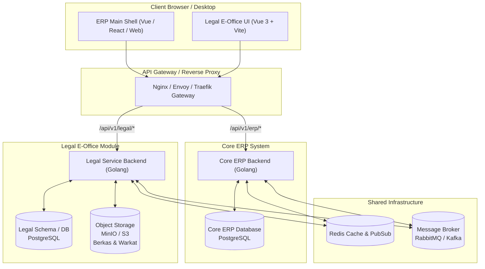

# Dokumentasi Modul Legal E-Office
### Enterprise Legal Management System (LMS) – Sub-Modul ERP Berbasis Golang & Vue 3

Dokumentasi ini dirancang khusus untuk memandu pemisahan dan integrasi **Legal E-Office** sebagai **modul mandiri (*independent pluggable module*)** ke dalam ekosistem **Enterprise Resource Planning (ERP)** perusahaan yang menggunakan backend **Go (Golang)**.

---

## 📑 Daftar Isi Dokumentasi

| No | Dokumen | Deskripsi Isi | Tautan Berkas |
|---|---|---|---|
| 1 | **Arsitektur & Tech Stack** | Arsitektur microservice/modular monolith Go, stack frontend Vue 3, shared JWT auth, database isolation, object storage, dan pola integrasi ERP | [01-arsitektur-dan-techstack.md](./01-arsitektur-dan-techstack.md) |
| 2 | **Katalog Fitur & Spesifikasi** | Rincian lengkap 16 modul bisnis legal: CLM, Surat & Somasi, Tender Vault, Jaminan Bank, Perizinan OSS, Sengketa & Arbitrase, LDD, Template Generator, dll | [02-katalog-fitur-dan-spesifikasi.md](./02-katalog-fitur-dan-spesifikasi.md) |
| 3 | **Spesifikasi API & Integrasi Go** | Desain REST API / gRPC, Go structs, GORM/pgx models, DDL PostgreSQL schema, Webhook, dan middleware komunikasi antar-modul ERP | [03-spesifikasi-api-dan-integrasi-golang.md](./03-spesifikasi-api-dan-integrasi-golang.md) |
| 4 | **Panduan Implementasi & Deployment** | Struktur folder proyek Go, pengemasan frontend (Micro-Frontend / `embed.FS`), Docker Compose multi-container, dan checklist go-live | [04-panduan-implementasi-dan-deployment.md](./04-panduan-implementasi-dan-deployment.md) |

---

## 🎯 Tujuan Pemisahan Modul

1. **Decoupled Architecture**: Legal E-Office memiliki logika domain hukum yang spesifik dan independen, sehingga tidak membebani core engine ERP (akuntansi/keuangan/inventory), namun tetap berbagi data master entitas, vendor, dan user.
2. **Backend Golang High Performance**: Memanfaatkan kecepatan, efisiensi memori, dan konkurensi native Go untuk melayani penanganan berkas legal, pencarian klausul teks, dan otomasi alur persetujuan (*approval flows*).
3. **Frontend Interaktif & Modern**: Mengadopsi Vue 3 Composition API dengan Tailwind CSS dan Vite yang dapat di-*mount* langsung sebagai micro-frontend atau sub-route dalam dashboard utama ERP.
4. **Keamanan & Kepatuhan Tinggi**: Data hukum seperti sengketa, legal opinion, dan hasil uji tuntas (LDD) memerlukan isolasi izin hak akses (RBAC ketat) yang terpisah dari staf operasional umum ERP.

---

## 🏗️ Gambaran Integrasi Tingkat Tinggi

---
*Dibuat untuk Tim Rekayasa Perangkat Lunak & Legal Corporate Perseroan.*
