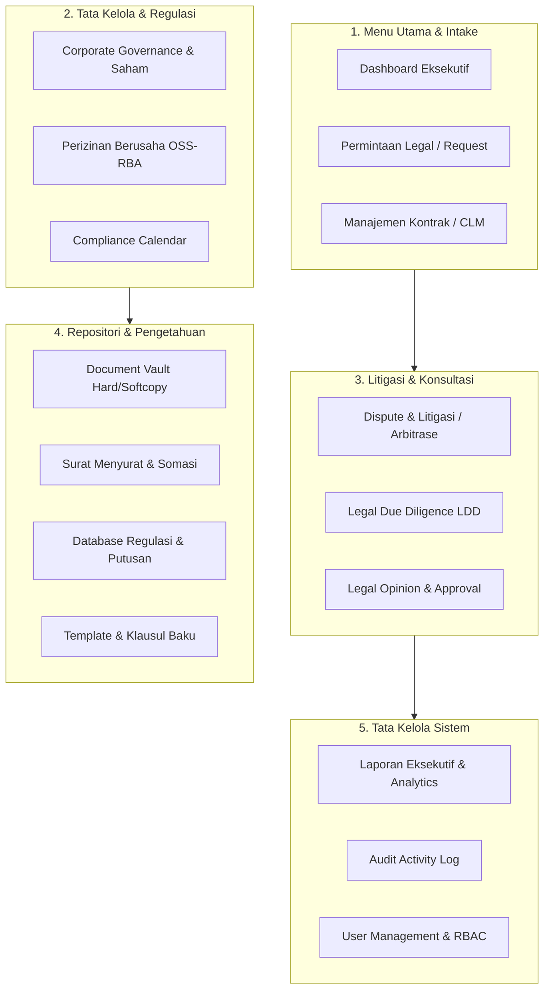

# Rangkuman Fitur & Arsitektur Sistem: LMSTOHA (Legal Management System)

> **Platform URL**: [https://lmstoha.ai.studio/](https://lmstoha.ai.studio/)  
> **Identitas Sistem**: *LEGAL MANAGEMENT SYSTEM (LMS) – Corporate Legal Enterprise Portal*  
> **Entitas Referensi**: PT Nusantara Energi & Grup Perusahaan  
> **Tanggal Analisis**: Oktober 2026  

---

## 1. Ikhtisar Platform

**LEGAL MANAGEMENT SYSTEM (LMS)** adalah platform korporat berbasis web modern yang dirancang untuk mengintegrasikan dan mensentralisasikan seluruh proses operasional divisi hukum (*Legal Department*) perusahaan. Sistem ini mencakup siklus hidup kontrak bisnis (*Contract Lifecycle Management*), manajemen kepatuhan regulasi, perizinan berusaha, tata kelola korporasi & akta, penanganan perkara sengketa & arbitrase, pelaksanaan uji tuntas (*Legal Due Diligence*), pembuatan opini hukum, repositori dokumen terenkripsi, hingga jejak audit (*Audit Trail*).

---

## 2. Struktur Modul & Rincian Fitur

Sistem terdiri atas **16 modul utama** yang dikelompokkan ke dalam 5 pilar fungsional:

| No | Modul | Kategori | Kode Sistem | Ringkasan Fungsi Utama |
|---|---|---|---|---|
| 1 | **Dashboard Eksekutif** | Operasional Utama | `dashboard` | Metrik KPI, grafik performa, dan alert jatuh tempo |
| 2 | **Permintaan Legal** | Operasional Utama | `requests` | Ticketing intake layanan hukum dari divisi operasional |
| 3 | **Manajemen Kontrak** | Operasional Utama | `contracts` | CLM lengkap, tracking nilai, tanggal, & alert expiry |
| 4 | **Corporate** | Korporasi & Regulasi | `corporate` | Profil PT, saham, direksi/komisaris, akta, RUPS, & BO |
| 5 | **Perizinan Berusaha** | Korporasi & Regulasi | `licensing` | Monitoring izin OSS-RBA, IUPTL, AMDAL, PBG, SLF |
| 6 | **Compliance** | Korporasi & Regulasi | `compliance` | Kalender kepatuhan wajib & pelaporan LKPM BKPM |
| 7 | **Dispute & Litigation** | Perkara & Analisis | `disputes` | Kasus perdata, PHI, PTUN, arbitrase BANI, & jadwal sidang |
| 8 | **Legal Due Diligence** | Perkara & Analisis | `ldd` | Audit uji tuntas transaksi/investasi & matriks risiko |
| 9 | **Legal Opinion** | Perkara & Analisis | `opinions` | Penyusunan pendapat hukum & workflow approval bertingkat |
| 10 | **Dokumen Vault** | Repositori & Arsip | `documents` | Manajemen lokasi fisik ordner dan file digital terenkripsi |
| 11 | **Surat Menyurat** | Repositori & Arsip | `correspondence` | Buku agenda surat keluar/masuk, surat kuasa, & somasi |
| 12 | **Database Regulasi** | Repositori & Arsip | `knowledge` | Kompilasi UU, PP, Permen, dan Yurisprudensi MA |
| 13 | **Template & Klausul** | Repositori & Arsip | `templates` | Bank template bilingual & klausul standar korporat |
| 14 | **Laporan Eksekutif** | Laporan & Audit | `reports` | Analitik tahunan beban kerja, SLA, & eksposur sengketa |
| 15 | **Audit Activity Log** | Laporan & Audit | `activity` | Jejak rekam aktivitas pengguna (audit trail menyeluruh) |
| 16 | **Pengaturan Sistem** | Konfigurasi | `settings` | Manajemen akun user & Role-Based Access Control (RBAC) |

---

### Detail Fitur Tiap Modul

### 1. Dashboard Eksekutif (`dashboard`)
* **KPI Metrics**: Total tiket permintaan legal, jumlah kontrak aktif, tingkat kepatuhan regulasi (%), perkara berjalan, dan opini hukum pending approval.
* **Early Warning System (Alerts)**:
  * Pengingat kontrak kedaluwarsa dalam 30, 60, dan 90 hari.
  * Peringatan jatuh tempo perizinan operasional.
  * Pengingat jadwal sidang perkara / mediasi terdekat.
  * Notifikasi kewajiban pelaporan kepatuhan (*Overdue* & *Upcoming*).
* **Shortcut Quick Actions**: Tombol pengajuan cepat tiket permohonan legal dan pembuatan register.

### 2. Permintaan Legal (*Legal Request & Intake*) (`requests`)
* **Sistem Tiket Permohonan**: Form permohonan dari unit bisnis/operasional lain (Kategori: Review Kontrak, Drafting, Legal Opinion, Perizinan, Konsultasi, Litigasi).
* **Workflow Status**: `DRAFT` ➔ `SUBMITTED` ➔ `IN_REVIEW` ➔ `IN_PROGRESS` ➔ `COMPLETED` / `REJECTED`.
* **Manajemen Tiket**:
  * Penugasan PIC Legal Counsel internal.
  * Klasifikasi prioritas: `LOW`, `MEDIUM`, `HIGH`, `URGENT`.
  * Penetapan SLA & target tanggal penyelesaian (*deadline*).
  * Pengunggahan berkas pendukung dan histori catatan penelaahan.

### 3. Manajemen Kontrak (*Contract Lifecycle Management*) (`contracts`)
* **Database Kontrak Terpusat**: Pencatatan nomor kontrak, para pihak (*counterparties*), jenis perjanjian (PPA, EPC, Vendor/Pengadaan, Jasa Konsultansi, dsb.).
* **Aspek Finansial & Legal**: Nilai komitmen kontrak (*multi-currency*: IDR & USD), penentuan batas kewajiban (*limitation of liability*), dan klausul penalti.
* **Siklus Hidup Perjanjian**: Tanggal efektif, tanggal pengakhiran (*expiry date*), amandemen/addendum, status perpanjangan otomatis (*auto-renewal*), dan pengakhiran kontrak.

### 4. Corporate Governance & Legalitas Perseroan (`corporate`)
Menyediakan 6 sub-fitur navigasi tab:
1. **Profil Korporat & Legalitas**: Identitas entitas, status perseroan, NIB, NPWP, domisili kantor, modal dasar, dan modal ditempatkan/disetor.
2. **Pemegang Saham (*Shareholders*)**: Komposisi pemegang saham, jumlah lembar saham, nilai nominal, dan porsi persentase kepemilikan.
3. **Direksi & Dewan Komisaris**: Struktur pengurus perseroan, identitas NIK/Paspor, jabatan, dasar pengangkatan, dan masa jabatan.
4. **Akta Notaris & AHU**: Inventarisasi akta pendirian, akta perubahan anggaran dasar, nama notaris pembuat akta, tanggal akta, dan SK persetujuan/penerimaan Kemenkumham (AHU).
5. **RUPS & Keputusan Sirkuler**: Dokumentasi risalah RUPS Tahunan (RUPST), RUPS Luar Biasa (RUPSLB), serta Keputusan Sirkuler Para Pemegang Saham sebagai pengganti RUPS.
6. **Beneficial Ownership (BO)**: Pencatatan identitas pemilik manfaat pengendali akhir sesuai regulasi PPATK & Kemenkumham.

### 5. Perizinan Berusaha (*Licensing & OSS-RBA*) (`licensing`)
* **Monitoring Izin Operasional**: Pengawasan izin teknis & operasional (NIB Berbasis Risiko, IUPTL Ketenagalistrikan, AMDAL, UKL-UPL, PBG, SLF, Izin Lingkungan, dan kode KBLI).
* **Pelacakan Masa Berlaku**: Perhitungan otomatis sisa hari masa berlaku (*countdown*) atau penanda "Selama Operasional".
* **Koleksi Arsip Izin**: Pencatatan nomor izin, tanggal terbit, instansi penerbit (Kementerian ESDM, BKPM, DLH), dan berkas salinan izin.

### 6. Kepatuhan Hukum (*Compliance Management*) (`compliance`)
* **Kalender Kepatuhan Wajib**: Monitoring kewajiban statuter perseroan secara berkala.
* **Pelaporan Wajib Regulator**: Pelaporan LKPM BKPM Triwulanan, Wajib Lapor Ketenagakerjaan (WLTK), pelaporan semesteran RKL-RPL lingkungan hidup, dan kewajiban pajak korporasi.
* **Status Pemenuhan**: Indikator status kepatuhan (`COMPLIANT`, `UPCOMING`, `OVERDUE`), dasar regulasi rujukan, serta divisi internal yang bertanggung jawab.

### 7. Perkara & Sengketa Litigasi (*Dispute & Litigation*) (`disputes`)
* **Registrasi Perkara**: Penanganan sengketa di lembaga peradilan (Pengadilan Negeri/Perdata, PTUN, PHI) dan lembaga arbitrase (BANI, SIAC).
* **Data Sengketa**: Pihak Pemohon/Penggugat vs Termohon/Tergugat, nilai tuntutan ganti rugi (*claim value*), dan penunjukan kuasa hukum eksternal (*external law firm*).
* **Timeline Kronologis Sidang**: Pencatatan tahapan sidang mulai dari pendaftaran permohonan, penetapan majelis/hakim, eksepsi, pembuktian/saksi ahli, mediasi, hingga pembacaan putusan dan tahapan eksekusi.

### 8. Legal Due Diligence (LDD) (`ldd`)
* **Uji Tuntas Transaksi Strategis**: Evaluasi risiko hukum untuk proyek investasi, merger, akuisisi anak usaha, dan pembiayaan sindikasi perbankan.
* **Checklist Uji Tuntas Multisektoral**: Pemeriksaan aspek legalitas korporasi, perizinan berusaha, status hak atas tanah/aset, kontrak-kontrak material, ketenagakerjaan, serta riwayat sengketa.
* **Risk Matrix & Mitigasi**: Pengelompokan level risiko (`LOW`, `MEDIUM`, `HIGH`, `CRITICAL`), uraian temuan yuridis (*findings*), dan usulan rekomendasi mitigasi risiko bagi manajemen.

### 9. Legal Opinion (*Pendapat Hukum*) (`opinions`)
* **Struktur Formal Telaah Hukum**: Penyusunan dokumen kajian resmi dengan sistematika:
  1. *Pokok Isu Hukum (Legal Issue)*
  2. *Latar Belakang & Fakta-Fakta Hukum*
  3. *Landasan Regulasi & Ketentuan Acuan*
  4. *Analisis Yuridis Mendalam*
  5. *Kesimpulan & Rekomendasi Mitigasi*
* **Workflow Persetujuan Bertingkat**: Mekanisme peninjauan status: *Draft* ➔ *Review Senior Counsel / Legal Manager* ➔ *Approved by Lead Legal Director*.
* **Ekspor & Cetak**: Format cetak dokumen resmi untuk kebutuhan internal maupun eksternal.

### 10. Dokumen Vault & Repositori Terpusat (`documents`)
* **Dual Vault (Fisik & Digital)**: Manajemen penyimpanan dokumen hukum fisik asli (*hardcopy* di lemari besi tahan api / *fireproof safe*) sekaligus dokumen digital terenkripsi.
* **Metadata & Lokasi Arsip**: Pencatatan nomor ordner, nomor rak, nomor lemari penyimpanan fisik, PIC pengelola arsip, serta tanggal penyerahan.
* **Klasifikasi Kerahasiaan**: Label keamanan dokumen (*Strictly Confidential*, *Confidential*, *Internal Use Only*).

### 11. Surat Menyurat & Somasi (*Legal Correspondence*) (`correspondence`)
* **Agenda Surat Keluar & Surat Masuk**: Pencatatan penomoran resmi surat-surat hukum.
* **Tipe Korespondensi**: Surat Peringatan / Somasi Wanprestasi (*Legal Notice*), Surat Kuasa Khusus, Surat Tanggapan Hukum, Nota Dinas Tim Legal, dan Surat Permohonan ke Instansi Pemerintah.
* **Action Tracking**: Pengingat tenggat waktu tindak lanjut balasan surat (*follow-up deadline*).

### 12. Database Regulasi & Yurisprudensi (`knowledge`)
* **Pustaka Peraturan Perundang-Undangan**: Basis data regulasi yang relevan dengan operasional perseroan (UU PT / UU Cipta Kerja, UU ITE, PP 5/2021 OSS-RBA, PP 35/2021 Ketenagakerjaan/PKWT, Permen ESDM Ketenagalistrikan, Perpres Penanaman Modal).
* **Yurisprudensi Mahkamah Agung**: Kompilasi kaidah hukum dan putusan penting MA (contoh: batasan Wanprestasi vs *Force Majeure* / *Overmacht*).
* **Standar Klausul BANI**: Pedoman baku klausul arbitrase BANI edisi terbaru.

### 13. Template Dokumen & Klausul Baku (`templates`)
* **Library Template Kontrak Bilingual**:
  * *Non-Disclosure Agreement* (Bilingual ID/EN)
  * *Memorandum of Understanding* (MoU) Kemitraan Strategis
  * *General Service Agreement* (Perjanjian Jasa Profesional)
  * *EPC Contract* (FIDIC Silver Book standard)
  * *Surat Perintah Kerja* (SPK) Standar Pengadaan Barang & Jasa
  * Format Baku *Surat Somasi / Teguran Hukum*
  * Template Standar *Legal Opinion Korporat*
* **Koleksi Klausul Baku Standar**:
  * Klausul Kerahasiaan (*Confidentiality*)
  * Keadaan Memaksa (*Force Majeure*)
  * Batasan Tanggung Jawab (*Limitation of Liability*)
  * Ganti Rugi Bebas Tuntutan (*Indemnity*)
  * Hukum yang Berlaku & Arbitrase BANI (*Governing Law & BANI Arbitration*)
  * Pengakhiran & Pengabaian Pasal 1266 KUHPerdata (*Termination*)
  * Larangan Pengalihan & Perubahan Pengendali (*Assignment & Change of Control*)
  * Klausul Anti Korupsi & Kepatuhan Regulasi (*Anti-Bribery & Compliance*)

### 14. Laporan Eksekutif & Analitik (`reports`)
* **Dashboard Kinerja Tahunan**: Visualisasi grafik dan metrik operasional divisi hukum.
* **Analisis Data**: Distribusi volume kontrak per kategori nilai, rata-rata durasi penyelesaian tiket permohonan (*SLA Turnaround Time*), dan rekapitulasi nilai eksposur risiko sengketa.
* **Ekspor Laporan**: Fitur ekspor ringkasan laporan ke format spreadsheet (*Excel/CSV*).

### 15. Audit Activity Log (`activity`)
* **Jejak Audit Sistem Lengkap**: Rekam jejak kronologis setiap aksi pengguna di aplikasi.
* **Detail Log**: Mencatat Waktu/Timestamp, Nama Pengguna, Peran Pengguna (*Role*), Modul Terkait, Tipe Aksi (`LOGIN`, `CREATE`, `UPDATE`, `STATUS_CHANGE`, `DELETE`, `APPROVE`), Record ID yang diubah, dan deskripsi rincian perubahan.
* **Filter & Pencarian**: Filter riwayat log per modul spesifik serta fitur unduh data audit.

### 16. Pengaturan Sistem & Manajemen Pengguna (`settings`)
* **Manajemen Akun Pengguna**: Tambah, edit, dan hapus pengguna internal.
* **Role-Based Access Control (RBAC)**: Pembagian tingkatan hak akses:
  * **ADMIN**: Hak akses tak terbatas (konfigurasi sistem, user management, audit log, kelola master data).
  * **MANAGEMENT / DIREKSI**: Akses monitor eksekutif, tinjauan laporan, dan persetujuan tingkat tinggi.
  * **LEGAL MANAGER**: Supervisi operasional divisi hukum, penugasan PIC, persetujuan review dan opini hukum.
  * **LEGAL COUNSEL**: Penanganan operasional review kontrak, drafting, pembuatan opini hukum, dan litigasi.
  * **LEGAL STAFF**: Pelaksanaan administrasi arsip dokumen, registrasi surat menyurat, dan pembaruan izin.
  * **REQUESTOR (User Unit Bisnis)**: Hak akses terbatas pada Dashboard, pembuatan Permohonan Legal, dan pengunduhan template dokumen standar.
* **Fitur Switch Role**: Fasilitas beralih peran pengguna secara instan guna simulasi dan peninjauan hak akses UI.
* **Reset Data Default**: Fasilitas pengembalian basis data simulasi ke konfigurasi awal bawaan sistem.

---

## 3. Fitur Utilitas & Pengalaman Pengguna (UX)

1. **Pencarian Cepat Global (*Command Palette*)**:
   * Akses cepat melalui pintasan keyboard `Cmd + K` (Mac) atau `Ctrl + K` (Windows).
   * Memungkinkan pencarian instan lintas seluruh entitas data (nomor kontrak, nama rekanan, perkara sengketa, pasal regulasi, dokumen arsip).
2. **Notification Center**:
   * Notifikasi real-time untuk pengingat tenggat waktu sidang, jatuh tempo perpanjangan izin, dan kontrak yang mendekati masa habis.
3. **Ekspor Data Terstruktur**:
   * Fasilitas cetak dan unduh data ke format dokumen cetak resmi dan tabel lembar kerja.
4. **Desain Responsif & Modern**:
   * Dibangun dengan arsitektur SPA (*Single Page Application*) responsif berbasis React dan Vite, didukung tipografi modern (*Plus Jakarta Sans* & *JetBrains Mono*) serta navigasi sidebar interaktif.
