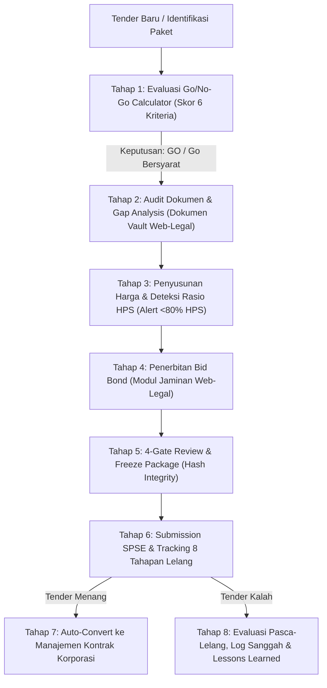

# Dokumentasi Analisis Gap: Modul Tender (ERP Konstruksi v6 vs. Web-Legal)

Dokumen ini membedah perbandingan arsitektural, fungsional, dan alur proses bisnis antara modul **Tender** pada prototype **ERP Konstruksi v6 (Surya Group)** dengan modul **Tender & Pengadaan Proyek** yang saat ini sedang kita bangun di **Web-Legal Enterprise**.

---

## 1. Perbedaan Filosofi & Orientasi Sistem

| Dimensi | Modul Tender di HTML (ERP Konstruksi v6) | Modul Tender di Web-Legal Saat Ini |
| :--- | :--- | :--- |
| **Fokus Utama** | **Komersial & Operasional Kontraktor (EPC)**: Penaksiran biaya (cost estimating), strategi harga penawaran (pricing), mitigasi risiko tender, dan konversi ke pelaksanaan proyek fisik. | **Legal, Tata Kelola & Kepatuhan (Corporate Legal & Compliance)**: Kepatuhan regulasi tender pemerintah/BUMN (Perpres PBJ), audit kelengkapan berkas kualifikasi, mitigasi risiko sengketa lelang, dan jaminan bank (bank guarantee/bond). |
| **Pengguna Kunci** | Tender Manager, Estimator / Quantity Surveyor (QS), Site Engineer, Finance Controller, Project Director. | Legal Counsel, Legal Manager, Corporate Secretary, Procurement/Tender Specialist, Board of Directors. |
| **Muara Akhir** | Konversi penawaran menang menjadi **Proyek Konstruksi Aktif** lengkap dengan WBS, BOQ-v0, dan RAP. | Konversi pemenang tender menjadi **Kontrak Korporasi Resmi**, repositori arsip berkas asli, pemantauan masa sanggah, dan SPPBJ. |

---

## 2. Matriks Perbandingan Fitur Head-to-Head

| Fitur / Sub-Modul | Di HTML (ERP Konstruksi v6) | Di Web-Legal Saat Ini | Gap / Status |
| :--- | :--- | :--- | :--- |
| **1. Pipeline & Tahapan Tender** | 6 Tahap Status: *Go/No-Go*, *Penyusunan*, *Review*, *Submitted*, *Evaluasi*, *Hasil (Menang/Kalah/Dikonversi)*. | **8 Tahap Standar Pengadaan (SPSE/LPSE)**: *Persiapan*, *Pengumuman*, *Aanwijzing*, *Pemasukan Dokumen*, *Evaluasi & Kualifikasi*, *Penetapan Pemenang*, *Masa Sanggah & SPPBJ*, *Penandatanganan Kontrak*. | **Web-Legal lebih mendalam** pada compliance alur pengadaan pemerintah/BUMN, sedangkan **HTML lebih taktis** pada kesiapan internal penawaran. |
| **2. Evaluasi Kelayakan (Go/No-Go Decision)** | **Tersedia Lengkap**: Skoring tertimbang 6 kriteria (*Kesesuaian Strategis 20%*, *Kapasitas 15%*, *Komersial 25%*, *Risiko Kontrak 15%*, *Arus Kas 15%*, *Teknis/K3 10%*). Slider interaktif, visualisasi circular score, rekomendasi otomatis (*Go*, *Go Bersyarat*, *No-Go*), dan tanda tangan Project Director. | **Belum Ada**: Status tender saat ini baru bersifat administratif (*DRAFT*, *ACTIVE*, *EVALUATION*, *WON*, *LOST*). | **GAP TINGGI**: Sangat baik diadopsi agar unit bisnis tidak asal mengikuti tender berisiko tinggi tanpa persetujuan legal/manajemen. |
| **3. Estimasi RAB, HPS & Pricing Strategy** | **Tersedia Lengkap**: Kalkulator estimasi biaya langsung (*Direct Cost*), biaya tidak langsung (*Indirect Cost*), kontinjensi risiko, target margin laba, dan deteksi otomatis penawaran **< 80% HPS** (peringatan wajib jaminan pelaksanaan tambahan sesuai regulasi). Dilengkapi wizard upload Excel/CSV 6 langkah. | **Dasar**: Hanya ada input field nilai pagu HPS dan nilai estimasi penawaran tanpa rincian direct/indirect cost, kalkulasi margin, maupun deteksi anomali <80% HPS. | **GAP TINGGI**: Analisis risiko harga penawaran <80% HPS sangat relevan bagi legal karena memicu risiko klarifikasi harga timpang dan penambahan jaminan bank. |
| **4. Matriks Approval / Gate Otorisasi** | **Tersedia 4 Gate Berurutan**: (1) Review Teknis (SE) $\rightarrow$ (2) Review Komersial (Fin/QS) $\rightarrow$ (3) Review Legal & Risiko Kontrak (CM) $\rightarrow$ (4) Otorisasi Harga Final (PD). Menerapkan *Segregation of Duties* (pembuat RAB dilarang mengesahkan harga). | **Parsial**: Memiliki RBAC (Admin, Manager, Counsel, Staff, Requestor) dan tombol perubahan status, namun belum ada urutan gate approval formal yang mengunci penawaran sebelum submit. | **GAP SEDANG**: Web-Legal dapat menerapkan approval gate serupa sebelum dokumen tender resmi diajukan ke portal LPSE. |
| **5. Audit Dokumen Persyaratan & Gap Analysis** | **Sederhana**: Daftar item persyaratan dengan checklist *Valid* / *Proses* / *Kurang*. | **Sangat Komprehensif & Unggul**: Dual-step navigation (Langkah 1: List paket $\rightarrow$ Langkah 2: Detail audit). Deteksi status *TERPENUHI*, *KURANG*, *KEDALUWARSA*. Integrasi langsung dengan Dokumen Vault (NIB, SBU, ISO, KSWP, Laporan KAP), serta upload bukti lampiran file. | **KEUNGGULAN WEB-LEGAL**: Fitur audit kualifikasi di Web-Legal jauh lebih matang untuk kebutuhan korporasi. |
| **6. Penguncian Paket (Package Lock & Hash)** | **Tersedia**: Tombol *"Kunci Paket Submission"* yang memvalidasi prasyarat (gate selesai & berkas valid), menghasilkan cryptographic hash anti-tamper, dan timestamp submission. | **Belum Ada**: Data tender dapat diubah kapan saja tanpa mekanisme pembekuan (freezing/locking) sebelum waktu pembukaan penawaran. | **GAP SEDANG**: Penguncian dengan jejak hash sangat penting secara hukum (*integrity & non-repudiation*) jika terjadi sengketa sanggah lelang. |
| **7. Jaminan Bank & Bid Bond** | **Tersedia Ringkas**: Dicatat sebagai satu baris persyaratan jaminan penawaran dan monitoring masa berlaku jaminan pelaksanaan. | **Sangat Mendalam**: Memiliki sub-modul khusus *Jaminan Bank & Bid Bond* (`TenderBondsView.vue`), tracking nomor BG/Surety Bond, bank penerbit, nilai jaminan, tanggal efektif/jatuh tempo, masa klaim, dan histori perpanjangan. | **KEUNGGULAN WEB-LEGAL**: Tata kelola instrumen finansial/legal penjaminan di Web-Legal lebih kuat. |
| **8. Tanya Jawab Klarifikasi (Aanwijzing / Q&A)** | **Tersedia**: Register log pertanyaan ke pokja/owner, kategori dampak (*Biaya, Waktu, Metode, Risiko*), pencatatan jawaban resmi, dan flag dampak ke penawaran. | **Belum Ada Log Detail**: Aanwijzing ada di dalam tahapan stepper, namun belum ada tabel terstruktur untuk mencatat daftar pertanyaan, jawaban pokja, dan Berita Acara Penjelasan (BAP). | **GAP SEDANG**: Catatan Aanwijzing krusial bagi legal saat mengajukan sanggahan apabila spesifikasi mengarah ke merek tertentu. |
| **9. Evaluasi Pemenang, Sanggah & Lessons Learned** | **Tersedia**: Evaluasi penawaran vs HPS, perbandingan peringkat, harga pemenang, selisih persentase, timeline PBJ (masa sanggah, SPPBJ), dan catatan *Lessons Learned* (evaluasi pasca-kalah). | **Parsial**: Memiliki tahap *Masa Sanggah & SPPBJ* pada stepper, tetapi belum ada pencatatan detail data pemenang lain, ranking, analisis selisih harga, dan modul evaluasi pasca-tender. | **GAP SEDANG**: Sangat bernilai untuk arsip pembuktian hukum dan evaluasi perbaikan strategi tender berikutnya. |
| **10. Transisi Pasca-Menang (Conversion Flow)** | **Otomatis ke Proyek**: Tombol *"Konversi Menjadi Proyek"* langsung membentuk workspace proyek konstruksi, mengubah estimasi final menjadi BOQ-v0, dan memetakan tim proyek. | **Manual ke Kontrak**: Tender yang dimenangkan diarahkan untuk didaftarkan ke modul *Manajemen Kontrak* (`contracts`), namun belum otomatis mentransfer data pagu dan syarat ke lembar kontrak baru. | **GAP SEDANG**: Dapat dibuat alur auto-create lembar draft kontrak dari tender yang berstatus `MENANG`. |

---

## 3. Rincian Fitur dari HTML yang Sangat Direkomendasikan untuk Diadopsi ke Web-Legal

Dari perbandingan di atas, ada **5 fitur unggulan dari HTML** yang akan memperkuat Web-Legal tanpa menghilangkan fokus hukum dan kepatuhannya:

### 1. Evaluasi Kelayakan Tender (Go / No-Go Decision Calculator)
* **Manfaat Legal & Korporasi**: Menghentikan unit bisnis mengikuti tender yang persyaratannya diskriminatif, berisiko denda likuidasi (*liquidated damages*) ekstrem, atau di luar kapasitas izin (SBU/KBLI perseroan).
* **Komponen yang diadopsi**:
  * 6 Kriteria Tertimbang (Kesesuaian Portofolio, Kapasitas Hukum & Perizinan, Margin, Risiko Kontrak & Klausul Denda, Arus Kas & Pembiayaan, Kesiapan Teknis).
  * Skor $\ge 75$ (Go), $60-74$ (Go Bersyarat dengan mitigasi klausul), $< 60$ (No-Go).
  * Catatan persetujuan resmi direksi / kepala divisi legal.

### 2. Deteksi Anomali Penawaran (< 80% HPS) & Kalkulasi Risiko Finansial
* **Manfaat Legal**: Berdasarkan Perpres PBJ dan standar tender konstruksi pemerintah:
  * Jika penawaran $< 80\%$ HPS, pokja tender **wajib melakukan evaluasi kewajaran harga** dan kontraktor **wajib menaikkan jaminan pelaksanaan menjadi 5% dari HPS** (bukan 5% dari penawaran).
  * Diadopsi: Menambahkan kalkulator otomatis pada input penawaran tender untuk mendeteksi rasio terhadap HPS dan memberikan alert peringatan penambahan biaya penerbitan bank garansi.

### 3. Matriks 4-Gate Review & Otorisasi Bertahap
* **Manfaat Governance**: Memastikan dokumen tender tidak dikirim ke portal SPSE sebelum ditinjau oleh:
  1. *Gate 1*: Review Kualifikasi & Dokumen Teknis (PIC Pengadaan)
  2. *Gate 2*: Review Biaya & Kelayakan Anggaran (Finance/Estimator)
  3. *Gate 3*: Review Legal & Risiko Klausul Kontrak (Legal Counsel)
  4. *Gate 4*: Otorisasi & Tanda Tangan Penawaran (Direksi / Project Director)

### 4. Penguncian Paket Berkas (Freeze Package & Cryptographic Hash)
* **Manfaat Pembuktian Hukum**: Saat paket tender siap diunggah ke SPSE/LPSE:
  * Sistem mengunci berkas (*immutable*), mencatat stempel waktu penguncian, dan membuat kode ringkasan (*hash string*).
  * Menjadi bukti sah integritas berkas jika di kemudian hari timbul sanggahan, tuduhan perubahan berkas, atau audit BPK.

### 5. Log Tanya Jawab Aanwijzing & Catatan Pasca-Tender (Lessons Learned)
* **Manfaat Kepatuhan**:
  * Tabel catatan pertanyaan teknis saat Aanwijzing beserta tanggapan pokja tender.
  * Catatan pasca-tender (analisis jika kalah: siapa pemenang, berapa selisih harga, apakah ada indikasi kecurangan untuk dasar sanggah, serta evaluasi dokumen kualifikasi).

---

## 4. Keunggulan yang Sudah Dimiliki Web-Legal (Harus Dipertahankan)

Web-Legal memiliki kekuatan yang **tidak dimiliki oleh HTML ERP Konstruksi**:
1. **Unifikasi Dokumen Vault**: Integrasi bank data kualifikasi perusahaan yang terpusat (Akte, SK Kemenkumham, NIB OSS, SBU LPJK, ISO, KSWP, Laporan KAP Audited) sehingga dokumen tidak di-upload berulang kali per tender.
2. **Audit Gap Dokumen Interaktif**: Deteksi berkas kurang, berkas kedaluwarsa, dan status pemenuhan per item persyaratan lelang dengan tampilan list sederhana (Langkah 1) dan detail gap analysis (Langkah 2).
3. **Sub-Modul Bank Garansi & Bid Bond Khusus**: Tata kelola instrumen penjaminan perbankan yang lengkap dengan masa tenggang klaim dan alert masa kedaluwarsa.
4. **Alur 8 Tahap Standar SPSE**: Runtutan tahapan lelang yang sangat presisi mengikuti tata cara pengadaan nasional.

---

## 5. Rekomendasi Roadmap Integrasi

Dengan mengadopsi fitur kalkulator Go/No-Go, mitigasi risiko harga penawaran vs HPS, approval gate, dan log Aanwijzing dari HTML tersebut ke dalam Web-Legal, modul **Tender & Pengadaan Proyek** akan menjadi modul pengadaan terlengkap yang memadukan keunggulan operasional komersial dan kepatuhan hukum tingkat enterprise.
